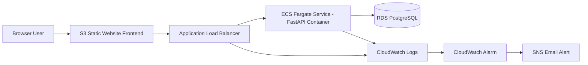

# Electro App Architecture

```mermaid
flowchart LR
  User[Browser User] --> S3[S3 Static Website Frontend]
  S3 --> ALB[Application Load Balancer]
  ALB --> ECS[ECS Fargate Service - FastAPI Container]
  ECS --> RDS[(RDS PostgreSQL)]
  ECS --> CW[CloudWatch Logs]
  ALB --> CW
  CW --> Alarm[CloudWatch Alarm]
  Alarm --> SNS[SNS Email Alert]
```

## Notes
- Public subnets host ALB and NAT Gateway.
- Private subnets host ECS tasks and RDS.
- Security groups allow only required east-west traffic.
